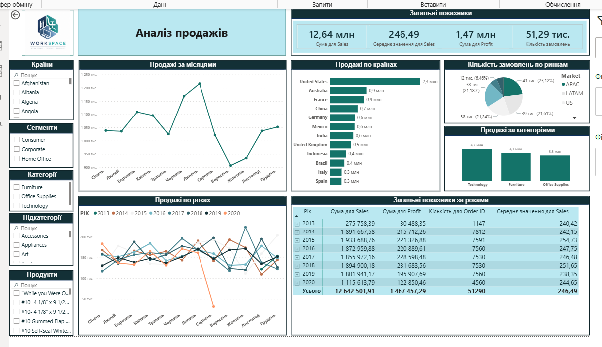

# Sales Dashboard (Power BI)

## Overview

Interactive sales dashboard built in **Power BI** using the **Superstore** dataset.

The dashboard provides an overview of sales performance across different countries, markets, product categories, customer segments, and time periods through interactive visualizations and KPI tracking.

---

## Dashboard Features

- Sales overview
- Profit analysis
- Order analysis
- Monthly sales trends
- Year-over-year comparison
- Sales by country
- Sales by product category
- Market distribution

### Interactive Features

The dashboard supports cross-filtering across all visuals.

Users can analyze results by:

- Country
- Market
- Customer Segment
- Product Category
- Product

---

## KPIs

The dashboard tracks:

- Total Sales
- Total Profit
- Number of Orders
- Average Sales per Order

---

## Technologies Used

- Power BI
- Power Query
- Basic DAX
- Data Modeling

---

## Business Questions Answered

- Which countries generate the highest sales?
- Which product categories perform best?
- How do sales change over time?
- Which markets generate the largest number of orders?
- How do customer segments differ?
- What are the main sales trends across years?

---

## Skills Demonstrated

- Dashboard Design
- KPI Development
- Interactive Reporting
- Data Visualization
- Data Modeling
- Business Analytics
